# 🍿 TMDB 영화 데이터셋: 탐색적 데이터 분석 (EDA)

---
## 목차
1. 소개
2. 데이터셋 개요
3. 데이터 전처리
4. 탐색적 데이터 분석
5. 핵심 인사이트 및 결론

## 팀 소개
> SK네트웍스 Family AI 캠프 11기 미니 프로젝트  
> 팀 명: 오졌조  
> 기간: 2025.03.10 - 2025.03.14  

<table>
  <thead>
    <td align="center">
      <a href="https://github.com/DawnSurplus">
         

        성호진
      </a> 
    </td>
    <td align="center">
      <a href="https://github.com/Ohjunghh">
         

        오정현
      </a> 
    </td>
    <td align="center">
      <a href="https://github.com/haides8973">
         

        이상준
      </a> 
    </td>
    <td align="center">
      <a href="https://github.com/comet39">
         

        이혜성
      </a>     
  </thead>
</table>

 

---
# 🎬 프로젝트 개요

 

## 프로젝트 소개
이 프로젝트는 영화 데이터를 기반으로 한 분석을 수행합니다.
 
주로 영화의 제작비와 수익 간의 관계, 장르별 수익 및 평점 분석, 감독과 배우의 영향 분석, 개봉 시기가 흥행에 미치는 영향을 조사합니다.

 

## 프로젝트 필요성

<table>
  <thead>
    <td><b>항목</b></td>
    <td><b>내용</b></td>
  </thead>
  <tbody>
    
  </tbody>
</table>

 

## 프로젝트 목표

- TMDB 영화 데이터셋을 활용하여 영화 흥행과 관련된 다양한 요인 탐색
- 데이터 전처리, 시각화, 통계 분석을 통해 영화 산업 트렌드 분석
- 특정 요소(제작비, 장르, 배우 등)가 영화의 성과(수익, 평점)에 미치는 영향 조사

 

## 기술 스택

### <DB 및 데이터 시각화>

  
  

 

## ~~WBS (제거해도 무방할듯?)~~

| **작업명** | **시작일** | **종료일** | **담당자** | **산출물** |
|:--:|:--:|:--:|:--:|:--:|
| 프로젝트 주제 선정 | 25.03.10 | 25.03.10 | ALL | - |

 

## ~~요구사항 명세서 (제거해도 무방할듯?)~~

| **툴/기술** | **업무구분** | **작업 내용** | **세부사항** |
|:--:|:--:|:--:|:--:|
| figma | **화면설계** | 화면 설계 | ... |

  

 

# **🗂 데이터셋 개요**

 

## **데이터 소스**
### Kaggle - **TMDB 5000 Movie Dataset**
- TMDB에서 제공하는 영화 데이터

 

## **데이터 구성**

1. **tmdb_5000_movies.csv**
   - 영화의 기본 정보를 포함
   - ex) **제작비, 수익, 장르, 평점 등**
2. **tmdb_5000_credits.csv**
   - 영화의 크레딧 정보를 포함
   - ex) **감독, 배우 정보 등**

 

## **주요 컬럼**

| 컬럼명 | 설명 | 데이터프레임 분리 유무 | 이상치 개수 |
| --- | --- | --- | --- |
| `id` | 영화 id |  |  |
| `title` | 영화 제목 |  |  |
| `budget` | 영화 제작 비용 |  | 1037 |
| `revenue` | 영화 수익 |  | 1426 |
| `genres` | 영화 장르 (JSON 형식) | O | 28 |
| `vote_average` | 평균 평점 |  | 63 |
| `vote_count` | 평점 투표 수 |  | 62 |
| `popularity` | 관객수 |  | 1 |
| `release_date` | 개봉일 |  | 1 |
| `production_companies` | 제작사 (JSON 형식) | O | 350 |
| `production_countries` | 제작 국가 |  | 174 |
| `cast` | 출연 배우 리스트 (JSON 형식) | O | 43 |
| `crew` | 감독 | O |  |

  

 

# **🛠 데이터 전처리**

1. **데이터 정제** : 누락된 값 및 빈 JSON 필드 새로운 데이터 프레임으로 분리
2. **이상치 처리**
   비현실적인 값 조정
    - release_date : 1개의 데이터이므로 drop
    - buget : 투자 수익률(ROI=revenue/buget) 수치에 큰 영향을 주는 이상값 drop
      | Budget | ROI |
      | --- | --- |
      | 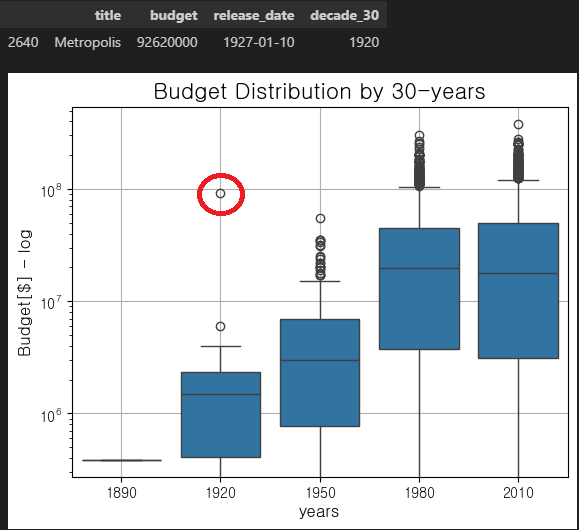 | 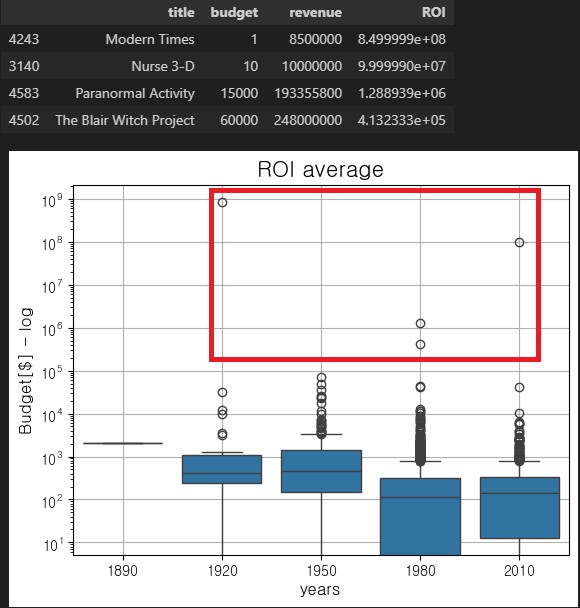 |
      | - 데이터는 맞으나 다른 Buget 데이터와 비교하기 위해 drop | - Buget이 너무 작아 ROI의 값이 너무 커짐 & 다른 ROI 데이터와 비교하기 위해 drop|
    - cast : 조연출에 대한 정보를 채워넣을 방법이 없어 drop
3. **결측치 처리**
   - revenue, buget : 합산하여 약 1500개의 누락값 존재 --> drop
     - 흥행요인(영화가 잘 되는 요인)을 분석하는데, null값이나 너무 낮은 값은 오히려 흥행이 안되서 데이터가 누락된 것으로 판단
     - 흥행하지 않은 데이터를 제외함으로써, 흥행요인에 대한 신뢰성 확보
4. **특성 엔지니어링** (새로운 컬럼 추가)
    - **투자 수익률(ROI)** : `(profit / budget) * 100`
    - **개봉 연도** : `release_date`에서 추출
    - **implation 적용 달러 수치** : `revenue`,`buget`에서 추출

  

 

# **🔍 탐색적 데이터 분석 (EDA)**

## 데이터 상관관계 확인
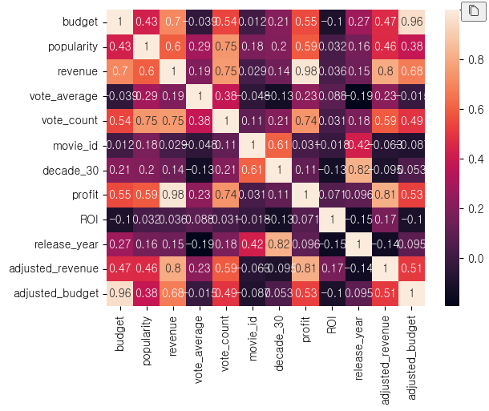
  

## 1️⃣ '제작비/평점/추천수' vs 수익 관계
- 영화의 제작비가 수익에 미치는 영향을 분석
- 제작비/평점/추천수가 높은 영화일수록 흥행 성공 가능성이 높을까?

### 📊 시각화 및 인사이트
`제작비와 수익 간의 상관관계`
> 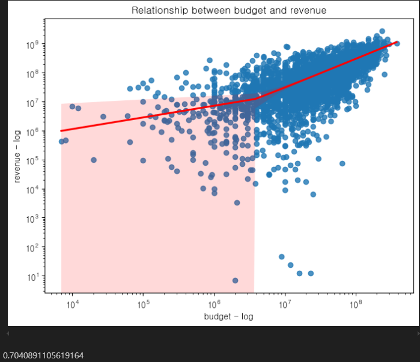
> 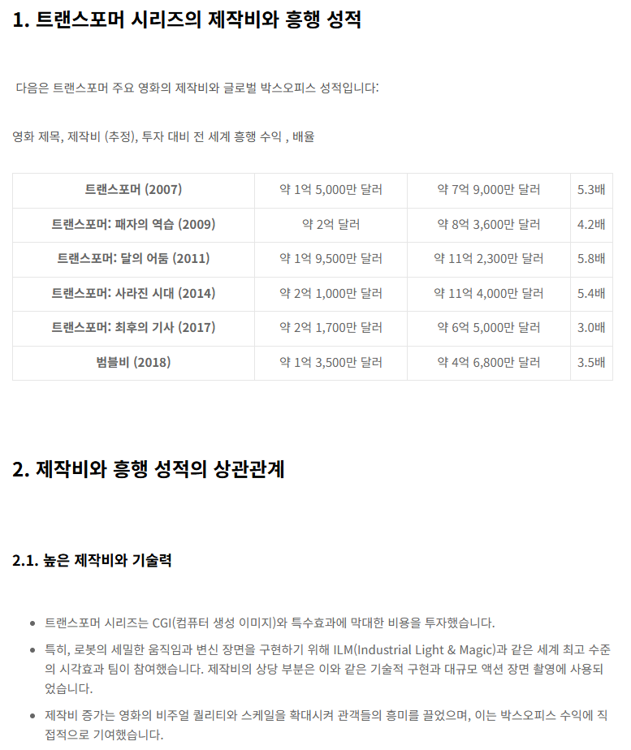
> - 제작비와 수익이 비례하는 것을 확인(양의 상관관계)했습니다.
> - 제작비용이 높을수록 영화의 퀄리티가 높아져 더 많은 관객들의 흥미를 끌 수 있습니다.
  

 

`평점와 수익 간의 상관관계`
> 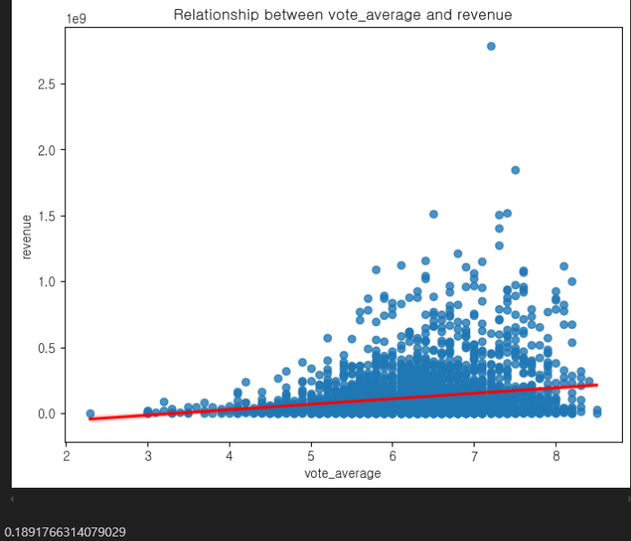
> - 의외로 평점과 수익은 비례하나 상관관계는 매우 적습니다.
> - 평점은 영화의 질을 반영하지만 대중적 흥행과 직접적 연관이 없고, 특히, 주관적인 평가가 미치는 영향이 큽니다.
  

 

`추천수와 수익 간의 상관관계`
> 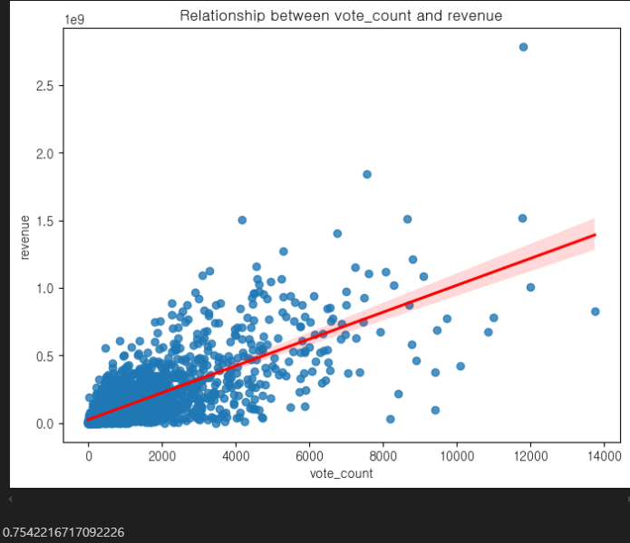
> - 추천수와 수익은 비례하며 상관관계가 큰 것을 확인했습니다.
> - 추천수는 관객 수와 직결되며, 관객 수가 많을수록 수익도 증가합니다.

  

 

## 2️⃣ 개봉 시기가 흥행에 미치는 영향
- 영화 산업의 역사
- 영화가 개봉한 계절(봄/여름/가을/겨울)에 따라 수익이 달라지는가?
- 어떤 장르가 어느 시즌에 흥행이 더 잘 되는가?

### 📊 시각화 및 인사이트

#### 연도별 영화 분포

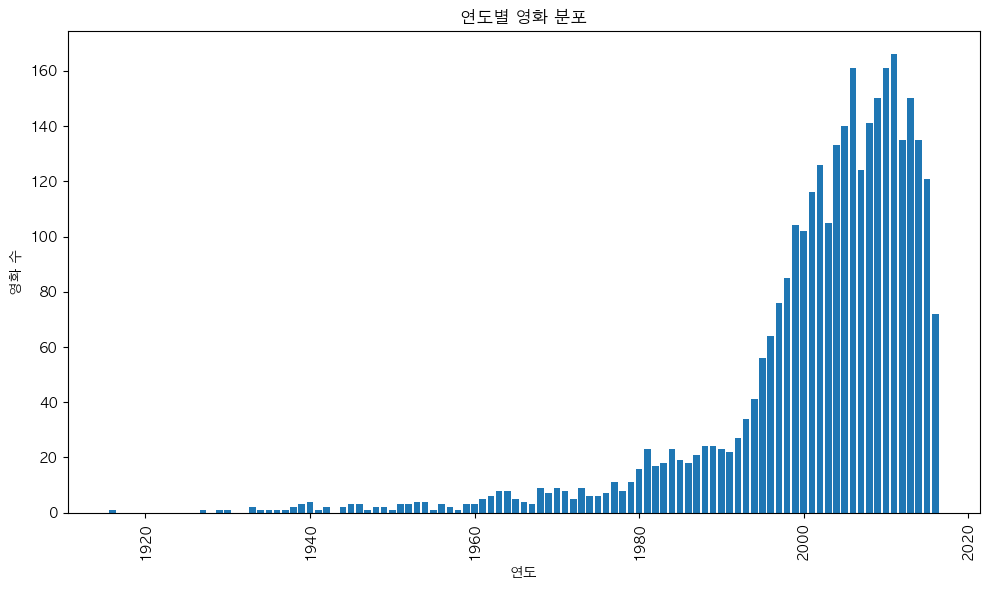
 

**장기적인 산업 성장**
전반적으로 영화 제작 수는 시간이 지남에 따라 꾸준히 증가했으며, 이는 영화가 중요한 문화적, 경제적 산업으로 자리 잡았음을 보여줍니다.
  

#### 연도별 수익 변화 분석

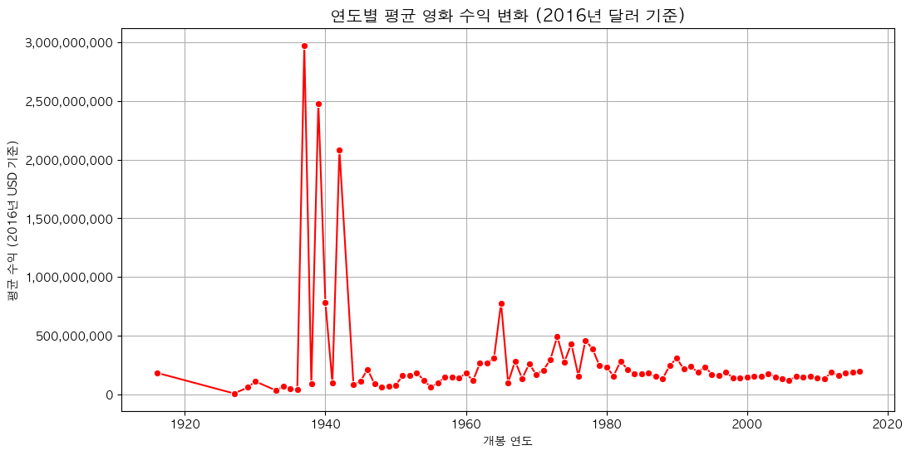

 

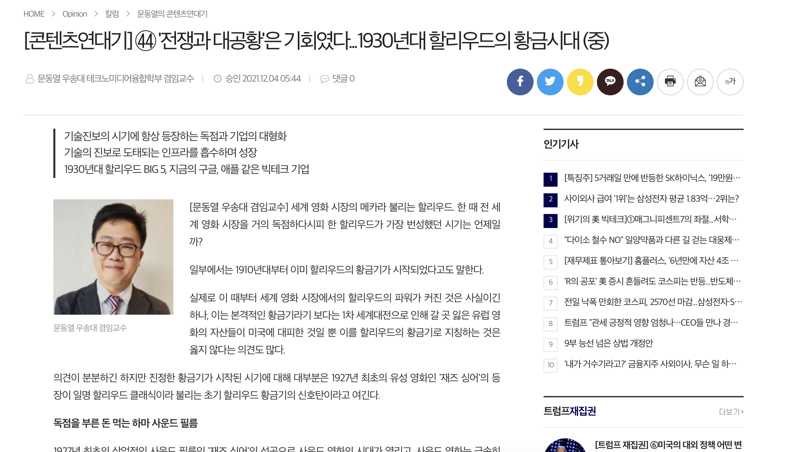

1. **1930~1940년대 : 급격한 수익 증가**
  그래프에서 가장 두드러진 특징은 1940년대 초반에 평균 영화 수익이 급격히 증가했다는 점입니다. 
  이는 당시 전쟁과 관련된 요인이 영향을 미쳤을 가능성이 큽니다. 제2차 세계대전 기간 동안 영화는 중요한 대중 매체로 자리 잡았으며, 전쟁 선전 및 대중의 관심을 끌기 위한 콘텐츠가 많이 제작되었습니다.
 

2. **1950~1970년대 : 안정화**
  1950년대 이후에는 평균 수익이 비교적 낮아지고 안정적인 흐름을 보입니다.
  이 시기는 텔레비전의 보급으로 인해 영화 산업이 경쟁 압박을 받던 시기입니다. 그러나 동시에 컬러 영화와 새로운 기술적 혁신이 등장하며 점진적인 회복세를 보였습니다.
 

3. **1980~2000년대 : 현대 영화 산업**
  1980년대 이후부터는 평균 수익이 다시 상승하는 경향을 보이며, 이후 안정적인 흐름을 유지합니다. 
  디지털 기술과 CGI(컴퓨터 그래픽)의 발전으로 제작비가 증가했지만, 관객들에게 더 큰 흥미를 제공하며 높은 수익을 창출했습니다.
 

4. **최근(2000~2020)의 변화**
  그래프에서 최근 몇 년간은 비교적 안정적인 수익 수준을 유지하고 있습니다. 
  이는 스트리밍 서비스와 같은 새로운 플랫폼의 등장으로 인해 극장 중심의 전통적 영화 산업이 변화하고 있다는 것을 반영할 수 있습니다.
 
 

#### 연도별 평균 영화 수익 변화

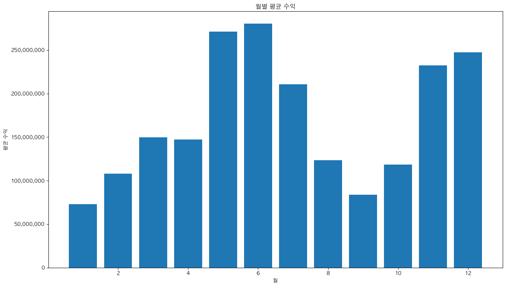

 
<li> 개봉 영화 수가 많다고 해서 반드시 평균 수익이 높은 것은 아닙니다.</li>
<li> 여름(6~8월)과 연말(12월)은 극장가의 성수기로, 흥행작들이 많이 개봉해 높은 수익을 기록합니다.</li>
<li> 반대로 봄(3~5월)과 가을(9~10월)은 상대적으로 비수기로, 중소규모 영화가 주를 이루며 평균 수익도 낮습니다.</li>

 
 

#### 시즌별 영화 흥행 요인 분석

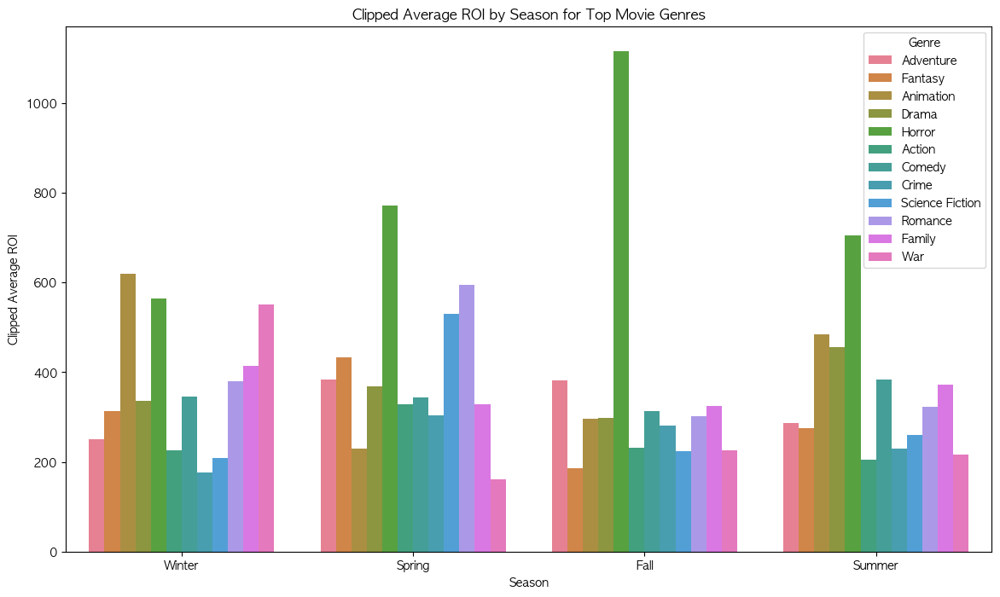

 

1. 가을 시즌의 호러 및 미스터리 영화 ROI 상승  
    여름 시즌에 호러, 미스터리 영화가 흥행할것이라고는 예상 했으나, 가을 시즌에 호러와 미스터리 영화의 ROI(Return on Investment)가 높은 이유는 할로윈 시즌의 영향 때문으로 보입니다. 할로윈은 전통적으로 공포 영화가 흥행하는 시기로, 관객들이 이 장르를 선호하는 경향이 강합니다.
    또한, 호러 영화는 제작비가 상대적으로 낮고, ROI가 높게 나타나는 장르로 알려져 있습니다. 특히, 할로윈 시즌에는 이 장르가 더욱 주목받아 수익성이 극대화됩니다
2. 연말 시즌(겨울)의 로맨스 및 가족 영화 
    연말 시즌에 로맨스와 가족 영화가 흥행할 것이라는 기대와 달리, 그래프에서는 해당 장르의 ROI가 두드러지지 않습니다.
    이는 최근 몇 년간 로맨스 장르의 영화들이 관객들 사이에서 덜 주목받고 있으며, 특히 젊은 세대는 불필요한 로맨스 요소를 선호하지 않는 경향이 있다는 점과 관련이 있을 수 있습니다.

 

## 3️⃣ 감독 & 배우별 영향 분석

특정 감독이나 배우가 영화 수익과 평점에 어떤 영향을 미치는지 분석합니다.

가장 흥행 성적이 높은 감독/배우는 누구인가?

### 📊 시각화: 상위 흥행 감독 & 배우 분석

 

## 4️⃣ "폭망 영화" 유형 분석 → 제작비 대비 영화 흥행률 비교
- 어떤 장르가 실패 확률이 높은지?
- 특정 배우나 감독이 있는 경우 실패율이 높은지?
- 개봉 시기와의 관계는?

### 📊 시각화 및 인사이트

#### 폭망 영화 장르별 흥행률 비교
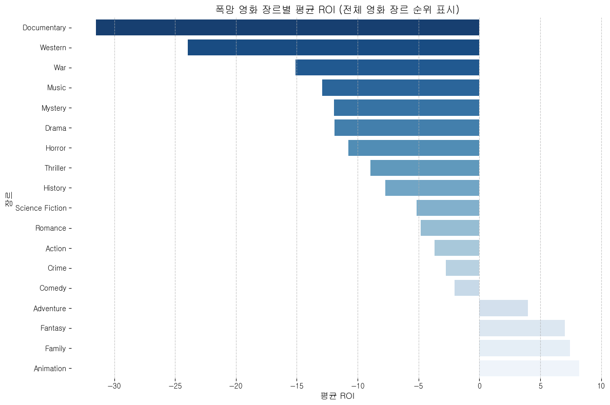

 

**하위 장르** 
Documentary, Western, War와 같은 하위 장르는 평균 ROI가 낮습니다. 이는 대중적으로 인기가 적은 장르들이며, 전체 영화 장르 19개 중에서 각각 18위, 17위, 15위에 해당하는 순위를 기록하고 있습니다. 개봉 횟수가 적어 흥행 성과도 제한적입니다.
 

**드라마 장르의 특징** 
드라마는 전체 영화 중 가장 많이 개봉된 장르이지만, 위의 그래프를 확인하면 실패 확률도 높은 편입니다. 이는 많은 제작자가 도전하지만 성공과 실패의 편차가 큰 장르임을 시사합니다.
 

**장르별 ROI와 개봉 비율의 상관관계** 
대중적인 장르라고 해서 ROI가 반드시 높은 것은 아니며, 특정 소수층 장르는 개봉수가 적어 ROI도 낮은 경향을 보입니다.
  
#### 출연 배우에 따른 폭망 영화 성적 비교
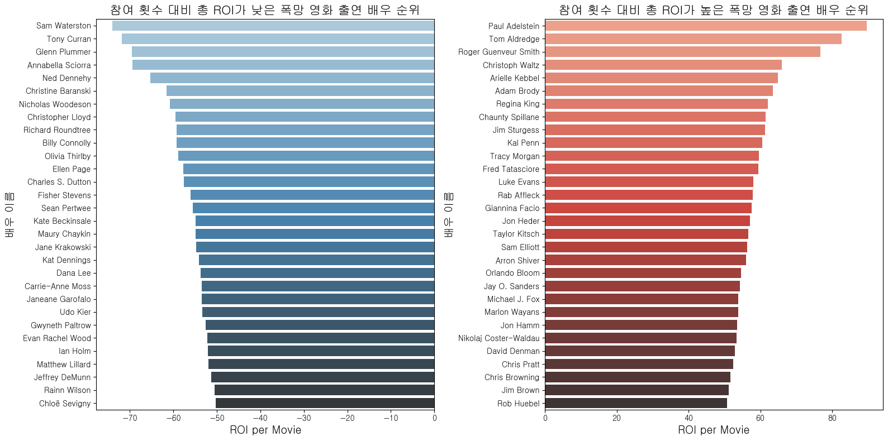

 
폭망한 영화에 참여한 배우 중 총 ROI가 제일 낮았던 배우는 Sam Waterston 입니다. Waterston이 출연한 일부 영화(Heaven's Gate)는 제작비가 과도하게 높았지만 흥행 실패를 기록했습니다. 이는 영화 역사상 가장 큰 손실 중 하나로 평가됩니다. 
 
폭망한 영화에 참여한 배우 중 총 ROI가 제일 높았던 배우는 Paul Adelstein입니다. 그의 역할은 주로 조연이나 단역으로 제한되었지만, 여러 성공적인 영화에 꾸준히 참여한 경력이 있어, 그가 선택한 폭망 영화들이 상대적으로 더 나은 투자 비율을 보였을 가능성이 있습니다. 
  

#### 전체 영화의 ROI 대비 폭망 영화의 ROI 분석
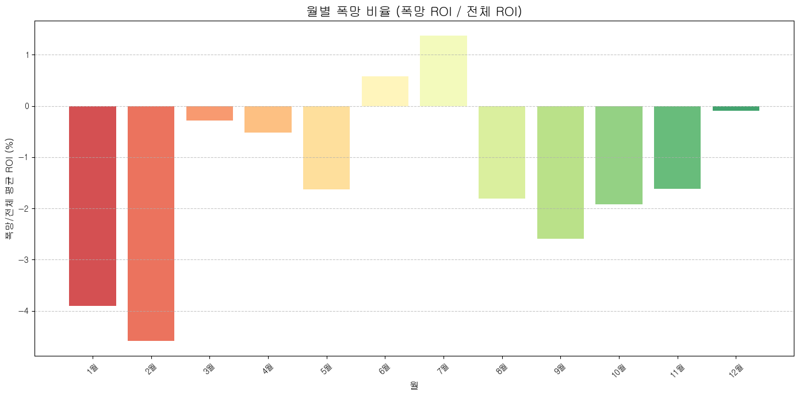

 
그래프에서 6월과 7월의 막대가 거의 0에 가까운 양의 값을 기록하고 있습니다. 폭망 영화들의 ROI 합이 전체 영화의 ROI 합에 비해 매우 작은 비율을 차지한다는 의미입니다. 
 
이는 성공적인 영화들이 전체 ROI를 끌어올렸기 때문에, 폭망 영화들의 영향력이 상대적으로 미미해졌음을 보여줍니다.
 

## **🏆 핵심 인사이트 및 결론(수정 필요)**

🔹 **'제작비/평점/추천수'와 수익 간의 관계**
- 대체로 **제작비가 많을수록 높은 수익을 기록**하는 경향이 있음.
- 의외로 **평점과 수익간의 관계는 낮은 편**이며, **추천수와 수익간의 관계가 높음**.
  

🔹 **장르별 분석**: 액션, 모험 장르가 평균적으로 높은 수익을 기록했으며, **비평적으로는 드라마와 다큐멘터리가 높은 평점**을 받음.
  

🔹 **감독과 배우의 영향**: 특정 감독과 배우가 **흥행 성적에 큰 영향을 미침** (예: 크리스토퍼 놀란, 스티븐 스필버그, 레오나르도 디카프리오 등)
  

🔹 **개봉 시즌과 흥행 관계**: 여름(6~8월)과 연말(12월)에 개봉한 영화들이 **가장 높은 수익을 올리는 경향**을 보임.
